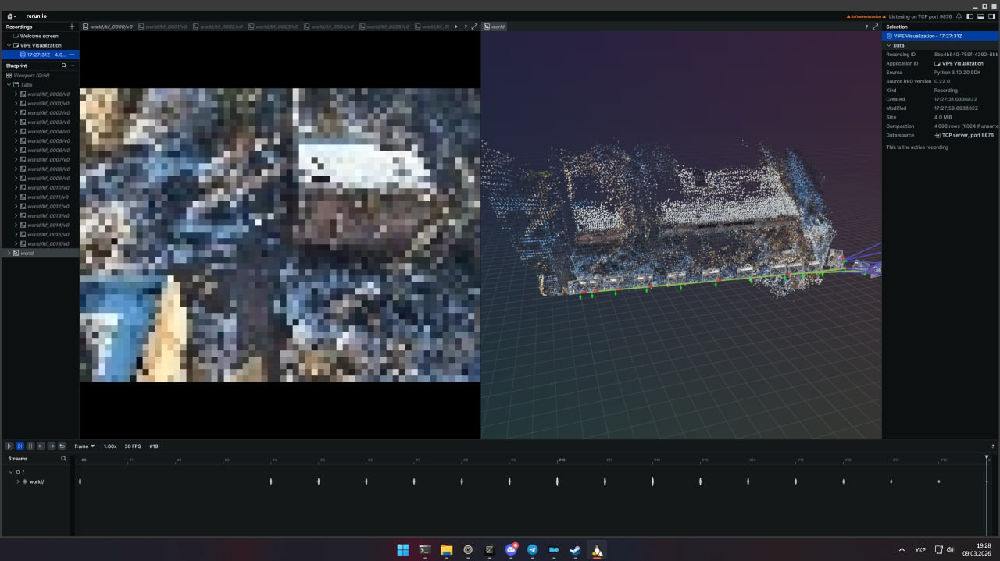

# Python Engineer Test Assignment

This repo packages solutions for the 4 optional tasks in `Python Engineer _ Test Assignment.pdf` behind a single CLI (`pet`).

## Quick start

```bash
uv sync --extra tasks --dev

# Activate the venv created by uv
source .venv/bin/activate

# Or run without activating
uv run pet --help
```

Add Task 4 GPU dependencies (downloads CUDA on Linux):

```bash
uv sync --extra task4-gpu --dev
```

Alternative (pip):

```bash
python -m venv .venv
source .venv/bin/activate
python -m pip install -e ".[dev,tasks]"

# Task 4 GPU dependencies
python -m pip install -e ".[task4-gpu]"
```

## Environment (.env)

If you want a local record of resource links, copy the template and edit as needed:

```bash
cp .env.example .env
```

The CLI does not read `.env` today; it is only a convenience for keeping URLs in one place.

## CLI

```bash
pet --help

pet task1 /path/to/video1.mp4 --output output/ --method lucas_kanade
pet task2 +1234567890 --dry-run "48.567123 39.87897 tank" --order lonlat
pet task3 /path/to/video2.mp4 --output output/ --method background_subtraction
pet task4 /path/to/dataset --workspace workspace --output demo.mp4 --dry-run
```

## Notes

- Task 2 full end-to-end requires `signal-cli` + a real Signal account and an ATAK/TAK client; smoke uses `--dry-run`.
- Task 4 full end-to-end requires a local NVIDIA GPU with CUDA + the external VIPE repo; smoke uses `--dry-run`.

## Task 4: VIPE Gaussian Splatting Demo



Screenshot demonstrating the VIPE Gaussian Splatting 3D reconstruction pipeline.
